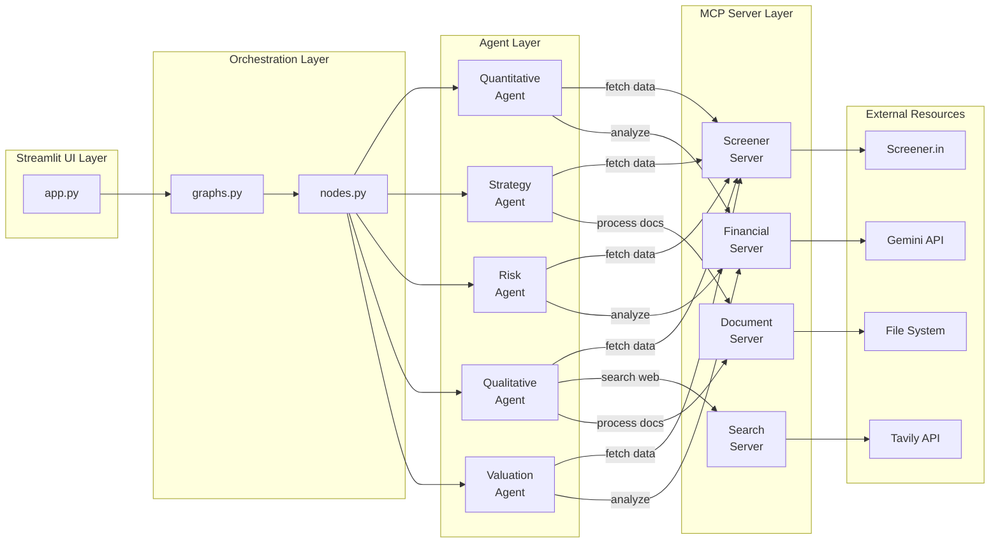

# MCP Integration Implementation Plan

## Goal

Integrate Model Context Protocol (MCP) into the existing multi-agent stock analysis system to standardize external resource access, improve maintainability, enable better testing, and create a more modular architecture.

## Benefits

- **Standardized interfaces** for all external data sources
- **Easier testing** through mockable MCP servers
- **Better error handling** with built-in retry logic
- **Resource management** via MCP's connection pooling
- **Flexibility** to swap data sources without changing agent code
- **Clean separation** between orchestration (LangGraph), agents, and data access (MCP)

---

## Architecture Overview


*The diagram above shows the five-layer architecture with MCP servers acting as the interface between agents and external resources.*

<details>
<summary>View Mermaid Source (for GitHub rendering)</summary>



</details>


---

## Implementation Phases

### Phase 1: Infrastructure Setup

Set up MCP dependencies and create the foundation.

#### Step 1.1: Install MCP Dependencies

```bash
pip install mcp anthropic-mcp-sdk
```

Update requirements.txt:
```txt
# Add MCP support
mcp>=1.0.0
```

#### Step 1.2: Create MCP Directory Structure

```
ai-stock-analysis-agent/
├── mcp_servers/
│   ├── __init__.py
│   ├── base.py              # Base MCP server utilities
│   ├── screener_server.py   # Screener.in MCP server
│   ├── financial_server.py  # Financial analysis MCP server
│   ├── search_server.py     # Tavily/search MCP server
│   └── document_server.py   # Document processing MCP server
├── mcp_clients/
│   ├── __init__.py
│   └── client_manager.py    # MCP client management
```

#### Step 1.3: Create Base MCP Utilities

Create `mcp_servers/base.py` with common functionality:
- Error handling
- Logging
- Connection management
- Retry logic

---

### Phase 2: Screener MCP Server

Create MCP server to standardize all Screener.in interactions.

#### Step 2.1: Design Resource URIs

Define standardized resource URIs:
```
screener://companies/{ticker}/profile
screener://companies/{ticker}/financials?consolidated=true
screener://companies/{ticker}/peers
screener://companies/{ticker}/excel
screener://companies/{ticker}/presentations/latest
screener://companies/{ticker}/transcripts/latest
screener://companies/{ticker}/transcripts/history?count=2
screener://companies/{ticker}/credit
```

#### Step 2.2: Implement Screener MCP Server

Create `mcp_servers/screener_server.py`:

**Resources to implement:**
- `get_company_profile()` - Basic company info
- `get_financials()` - Financial statements
- `get_peers()` - Peer comparison data
- `get_excel_data()` - Raw Excel files
- `get_presentations()` - Investor presentations
- `get_transcripts()` - Earnings call transcripts
- `get_credit_data()` - Credit ratings

**Tools to implement:**
- `search_company()` - Find company by name/ticker
- `download_documents()` - Batch download documents

#### Step 2.3: Refactor screener_handler.py

Move logic from screener_handler.py into MCP server.

---

### Phase 3: Financial Analysis MCP Server

Create MCP server for financial calculations and chart generation.

#### Step 3.1: Design Tool Interface

**Tools to implement:**
- `calculate_ratios()` - PE, ROE, Debt/Equity, etc.
- `analyze_trends()` - Revenue/profit trends
- `generate_chart()` - Create matplotlib charts
- `generate_comparison_table()` - Peer comparison tables
- `calculate_growth_rates()` - CAGR calculations
- `detect_anomalies()` - Flag unusual metrics

#### Step 3.2: Implement Financial MCP Server

Create `mcp_servers/financial_server.py`:

Extract chart generation and ratio calculation logic from quantitative_agent.py and valuation_agent.py.

---

### Phase 4: Search MCP Server

Create MCP server for Tavily web search capabilities.

#### Step 4.1: Design Search Resources

**Resources:**
```
search://news?company={name}&days=30
search://regulatory?company={name}&type=sebi
search://forums?company={name}&platform=valuepickr
```

**Tools:**
- `search_news()` - Recent news articles
- `search_regulatory()` - SEBI orders, filings
- `search_forums()` - Investment forums
- `search_management()` - Management background

#### Step 4.2: Implement Search MCP Server

Create `mcp_servers/search_server.py`:

Move Tavily integration from qualitative_analysis_agent.py.

#### Step 4.3: Add Rate Limiting

Implement rate limiting for Tavily API to prevent quota exhaustion.

---

### Phase 5: Document Processing MCP Server

Create MCP server for PDF/document processing.

#### Step 5.1: Design Document Tools

**Tools:**
- `extract_text_from_pdf()` - PDF text extraction
- `extract_tables()` - Table extraction from PDFs
- `summarize_document()` - Document summarization via LLM
- `search_document()` - Semantic search within documents

#### Step 5.2: Implement Document MCP Server

Create `mcp_servers/document_server.py`:

Consolidate PDF processing logic currently spread across agents.

---

### Phase 6: MCP Client Management

Create client utilities for agents to use MCP servers.

#### Step 6.1: Implement Client Manager

Create `mcp_clients/client_manager.py`:

```python
class MCPClientManager:
    def __init__(self, config):
        self.screener = MCPClient("screener")
        self.financial = MCPClient("financial") 
        self.search = MCPClient("search")
        self.document = MCPClient("document")
    
    async def initialize(self):
        # Connect to all MCP servers
        pass
    
    async def shutdown(self):
        # Clean up connections
        pass
```

#### Step 6.2: Update Agent Config

Modify state.py to include MCP clients:

```python
class StockAnalysisState(TypedDict):
    # ... existing fields ...
    mcp_clients: Dict[str, Any] | None  # MCP client instances
```

---

### Phase 7: Refactor Agents

Update each agent to use MCP instead of direct data access.

#### Step 7.1: Refactor Quantitative Agent

**Before:**
```python
def run_quantitative_analysis(file_data, config):
    excel_bytes = file_data.get('excel_data')
    df = pd.read_excel(excel_bytes)
    # ... analysis ...
```

**After:**
```python
async def run_quantitative_analysis(ticker, mcp_clients, config):
    # Fetch via MCP
    financial_data = await mcp_clients['screener'].read_resource(
        f"screener://companies/{ticker}/financials"
    )
    
    # Analyze via MCP tools
    ratios = await mcp_clients['financial'].call_tool(
        "calculate_ratios",
        {"data": financial_data}
    )
    
    charts = await mcp_clients['financial'].call_tool(
        "generate_chart",
        {"data": financial_data, "type": "revenue_trend"}
    )
```

#### Step 7.2: Refactor Strategy Agent

Update strategy_agent.py to use MCP for presentation downloads and analysis.

#### Step 7.3: Refactor Risk Agent

Update risk_agent.py to use MCP for credit data access.

#### Step 7.4: Refactor Qualitative Agent

Update qualitative_analysis_agent.py to use Search MCP Server.

#### Step 7.5: Refactor Valuation Agent

Update valuation_agent.py to use MCP for peer data and calculations.

---

### Phase 8: Update Orchestration Layer

#### Step 8.1: Update nodes.py

Modify nodes.py:

**Before:**
```python
def fetch_data_node(state: StockAnalysisState):
    from screener_handler import download_all_data
    file_data = download_all_data(state['ticker'])
    return {"file_data": file_data}
```

**After:**
```python
async def fetch_data_node(state: StockAnalysisState):
    mcp_clients = state['mcp_clients']
    ticker = state['ticker']
    
    # Parallel fetch via MCP
    profile = await mcp_clients['screener'].read_resource(
        f"screener://companies/{ticker}/profile"
    )
    financials = await mcp_clients['screener'].read_resource(
        f"screener://companies/{ticker}/financials"
    )
    
    return {
        "company_name": profile['name'],
        "file_data": {"financials": financials}
    }
```

#### Step 8.2: Update graphs.py

Ensure workflow graphs properly pass MCP clients through state.

#### Step 8.3: Update app.py

Initialize MCP clients in app.py:

```python
async def run_analysis_for_ticker(ticker, config, status_container):
    # Initialize MCP clients
    mcp_manager = MCPClientManager(config)
    await mcp_manager.initialize()
    
    inputs = {
        "ticker": ticker,
        "mcp_clients": mcp_manager.get_clients(),
        # ... other state ...
    }
    
    # Run workflow
    result = await target_graph.arun(inputs)
    
    await mcp_manager.shutdown()
    return result
```

---

### Phase 9: Testing

#### Step 9.1: Unit Tests for MCP Servers

Create `tests/test_mcp_servers.py`:
- Test each resource endpoint
- Test each tool
- Test error handling
- Test rate limiting

#### Step 9.2: Mock MCP Servers for Agent Tests

Create mock MCP servers for testing agents in isolation:
```python
class MockScreenerMCP:
    async def read_resource(self, uri):
        return MOCK_DATA[uri]
```

#### Step 9.3: Integration Tests

Test full workflow with real MCP servers:
- End-to-end analysis for known ticker
- Verify results match expected format
- Performance benchmarking

#### Step 9.4: Fallback Testing

Test that agents handle MCP server failures gracefully.

---

### Phase 10: Documentation & Deployment

#### Step 10.1: Update Documentation

- Document MCP server URIs and tools
- Create MCP server deployment guide
- Update agent documentation

#### Step 10.2: Configuration Management

Update `.env` for MCP server endpoints:
```
MCP_SCREENER_URL=http://localhost:8001
MCP_FINANCIAL_URL=http://localhost:8002
MCP_SEARCH_URL=http://localhost:8003
MCP_DOCUMENT_URL=http://localhost:8004
```

#### Step 10.3: Deployment Strategy

**Option A: Embedded Servers** (Simpler)
- MCP servers run as part of main application
- Start servers when Streamlit starts

**Option B: Standalone Servers** (More scalable)
- MCP servers run as separate processes
- Can scale independently
- Better for production

---

## Migration Strategy

### Incremental Rollout (Recommended)

1. **Phase 1-2**: Build Screener MCP Server
2. **Phase 3**: Test with Quantitative Agent only
3. **Verify**: Ensure Quant workflows still work
4. **Phase 4-5**: Build remaining MCP servers
5. **Phase 6**: Migrate remaining agents
6. **Phase 7**: Full integration testing
7. **Phase 8**: Deploy to production

### Parallel Running (Safest)

Keep old code paths while adding MCP:
```python
USE_MCP = os.getenv('USE_MCP', 'false').lower() == 'true'

if USE_MCP:
    # New MCP path
    data = await mcp_client.read_resource(uri)
else:
    # Legacy path
    data = old_screener_handler.download(ticker)
```

---

## Timeline Estimate

| Phase | Effort | Duration |
|-------|--------|----------|
| Phase 1: Infrastructure | Small | 2-3 hours |
| Phase 2: Screener Server | Medium | 1-2 days |
| Phase 3: Financial Server | Medium | 1 day |
| Phase 4: Search Server | Small | 4-6 hours |
| Phase 5: Document Server | Small | 4-6 hours |
| Phase 6: Client Manager | Small | 2-3 hours |
| Phase 7: Agent Refactoring | Large | 2-3 days |
| Phase 8: Orchestration Updates | Medium | 1 day |
| Phase 9: Testing | Medium | 1-2 days |
| Phase 10: Documentation | Small | 4-6 hours |
| **Total** | **~7-10 days** | **~1.5-2 weeks** |

---

## Risks & Mitigations

| Risk | Mitigation |
|------|------------|
| Breaking existing workflows | Parallel running, incremental rollout |
| Performance regression | Benchmark before/after, optimize MCP calls |
| MCP server downtime | Fallback to direct calls, health checks |
| Learning curve | Good documentation, start with one server |
| Over-engineering | Start simple, add features as needed |

---

## Success Metrics

- ✅ All 10 workflow modes working with MCP
- ✅ Unit test coverage >80% for MCP servers
- ✅ Performance within 10% of baseline
- ✅ Zero data loss or corruption
- ✅ Easier to add new data sources
- ✅ Cleaner agent code (less data access logic)

---

## Next Steps

1. **Review this plan** - Validate approach and timeline
2. **Decision on deployment** - Embedded vs standalone servers
3. **Start with Phase 1** - Set up infrastructure
4. **POC with Screener Server** - Prove concept with one server
5. **Iterate** - Refine based on learnings
